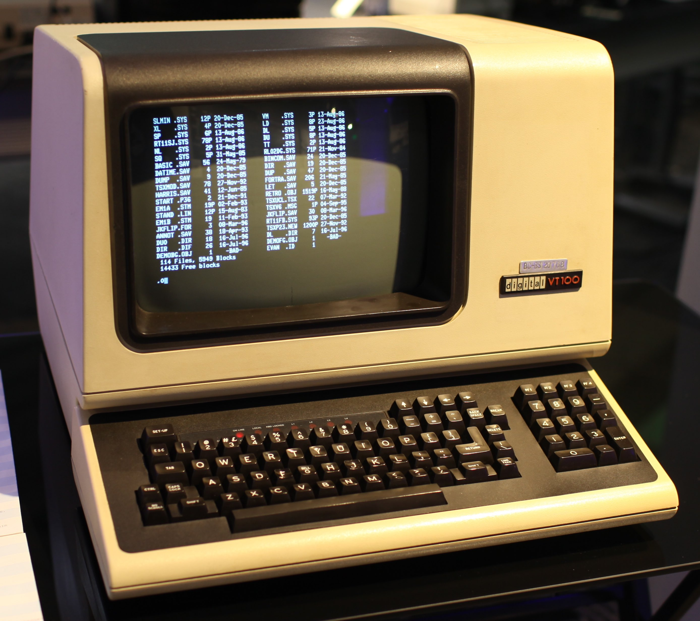
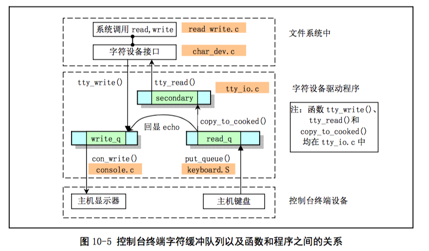
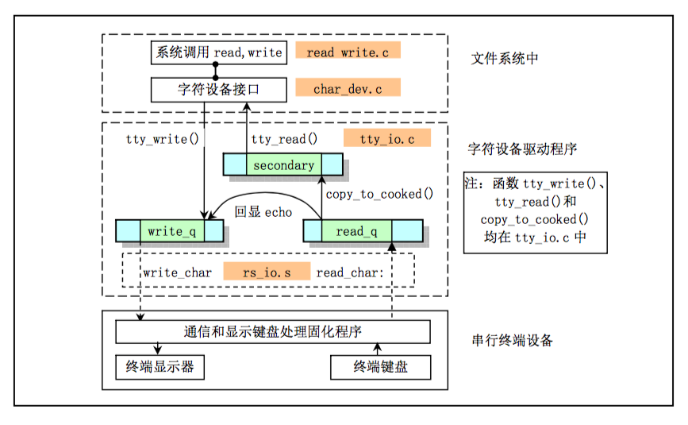

# Char Device
字符设备是指无法寻址的设备。主要有旧式终端（DEC生产的VT-100）、键盘、显示器等。

Linux0.1中主要包含了两类字符设备：
- 控制台终端(`keyboard.S,console.c`)
- 通过串口连接的串口终端设备（如VT-100）。(`rs_io.s`,`serial.c`)。

其实，最开始的计算机，是一个大型设备，机器本身在一个地方，然后有不同的设备通过串口线路连接到机器上。而这些设备就是所谓“终端”。一般地，这些设备就是一个简单的一体机，嵌一个屏幕，和键盘。其内部有固化的ROM来执行一些功能，如通信和指令解析。


[VT_100](https://en.wikipedia.org/wiki/VT100)


上面所说的串口终端设备，就是指这类设备，而`rs_io.s`、`serial.c`驱动了它们。

另外，Linux0.1使用键盘和显示器模拟了以前的终端设备。也就是在`keyboard.S`、`console.c`中实现了原有终端固化ROM中的功能，比如对特殊字符的解析，更多细节可以参考：[kernel/chr_drv/console.c:con_write](kernel/chr_drv/console.c)


## 模块
```
|----------------------------------------------------|
|       read_write.c(文件系统)
|----------------------------------------------------|
|       char_dev.c(字符设备外层API)       
|----------------------------------------------------|
|       tty_io.c(tty_read,tty_write)                 |
|----------------------------------------------------|
|   console.c,keyboard.S    |   rs_io.s,serial.c     |
|----------------------------------------------------|
|   显示器、键盘              | 终端
|----------------------------------------------------|
```

如上，
- `tty_io.c`提供了读写入口
- `console.c`,`keyboard.S`驱动显示器和键盘
- `rs_io.s`,`serial.c`驱动了通过串口连接的终端

### 调用
以写为例，调用栈如下：
- `sys_write` in `read_write.c`
- `rw_char` in `char_dev.c`
- `rw_tty` in `char_dev.c`
- `tty_write` in `tty_io.c`
- 根据设备不同，调用注册好的对应函数
    - `con_write` in `console.c` 如果是控制台
    - `rs_write` in `rs_io.c` 如果是串口终端


控制台程序调用流程：（来自"Linux内核完全注释"）  



串口终端程序调用流程：（来自"Linux内核完全注释"）  
