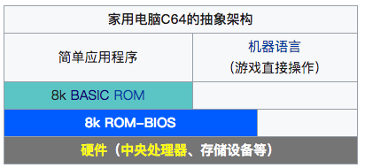
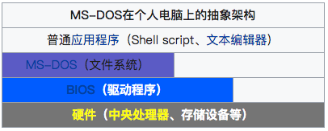
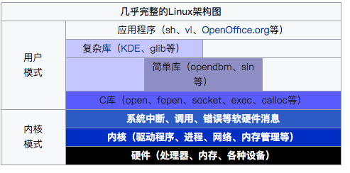
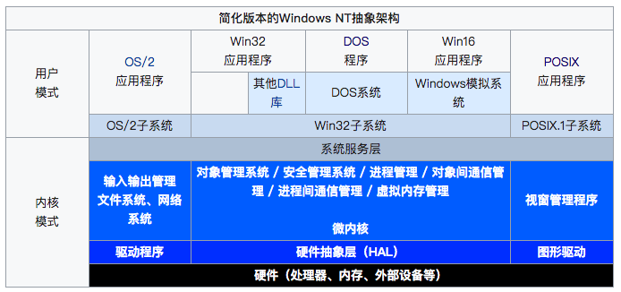

# History
- [History of Unix](#History_of_Unix)
- [History of Linux](#History_of_Linux)
- [History of Internet](#History_of_Internet)
- [History of POSIX](#History_of_POSIX)
- [Organization](#Organization)
- [History of OS](#History_of_OS)
- [History of Programming Languages](#History_of_Programming_Languages)
- [Other](#Other)

## History of Unix
- 1963 AT&T Multics project, failed afterwards.
- (__1970__) Unix was conceived and implemented by Ken Thompson and Dennis Ritchie in 1969 and first released in 1970
    - Unix was originally implemented in assembly language on a PDP-7 by Dennis Ritchie and Ken Thompson, incorporating several ideas from colleagues.
    - Eventually, they decided to port the operating system to a PDP-11. The original PDP-11 version of Unix was developed in assembly language.
    - The developers were considering rewriting the system using the __B__ language, Thompson's simplified version of __BCPL__ . However B's inability to take advantage of some of the PDP-11's features, notably byte addressability, led to C. The name of C was chosen simply as the next after B.
    - __The development of C started in 1972 on the PDP-11 Unix system and first appeared in Version 2 Unix__.
    - __Also in 1972, a large part of Unix was rewritten in C__.
    - By 1973, with the addition of struct types, the C language had become powerful enough that most of the Unix kernel was now in C.
- In 1977 Berkeley Software Distribution (BSD) developed, based on the 6th edition of Unix from AT&T
    - In 1978, Brian Kernighan and Dennis Ritchie published the first edition of __The C Programming Language__. This book, known to C programmers as __"K&R"__, served for many years as an informal specification of the language.
- (1980s) During the late 1970s and early 1980s, the influence of Unix in academic circles led to large-scale adoption of Unix (__BSD__ and __System V__) by commercial startups, including Sequent, HP-UX, Solaris, AIX, and Xenix. In the late 1980s, AT&T Unix System Laboratories and Sun Microsystems developed System V Release 4 (SVR4), which was subsequently adopted by many commercial Unix vendors.
- In 1983, Richard Stallman started the __GNU__ project with the goal of creating a free UNIX-like operating system. As part of this work, he wrote the GNU General Public License (GPL).
    - By the early 1990s, there was almost enough available software to create a full operating system. However, the GNU kernel, called Hurd, failed to attract enough development effort, leaving GNU incomplete
- In 1985, Intel released the __80386__, the first x86 microprocessor with a 32-bit instruction set and a memory management unit with paging.
- In __1986__, Maurice J. Bach, of AT&T Bell Labs, published __The Design of the UNIX Operating System__. This definitive description principally covered the System V Release 2 kernel, with some new features from Release 3 and BSD
- In __1987__, __MINIX__, was released by Andrew S. Tanenbaum to exemplify the principles conveyed in his textbook, __Operating Systems: Design and Implementation__.  
    - While source code for the system was available, modification and redistribution were restricted.
    - In addition, MINIX's 16-bit design was not well adapted to the 32-bit features of the increasingly cheap and popular Intel 386 architecture for personal computers.
    - In the early nineties a commercial UNIX operating system for Intel 386 PCs was too expensive for private users
- (1990s) AT&T filed a lawsuit against the University of Califonia, which strongly limited the development and adoption of BSD.
- In 1991, while studying computer science at University of Helsinki, Linus Torvalds began a project that later became the __Linux__ kernel(using a new PC with an 80386 processor, with MINIX, and GNU C compiler).
    - Although not released until 1992, due to legal complications, development of 386BSD, from which NetBSD, OpenBSD and FreeBSD descended, predated that of Linux. Torvalds has also stated that if 386BSD had been available at the time, he probably would not have created Linux
    - 1992 Linux 0.99 using the GNU GPL
    - 1991: The Linux kernel is publicly announced on 25 August by the 21-year-old Finnish student Linus Benedict Torvalds.[13]
    - 1992: The Linux kernel is relicensed under the GNU GPL. The first Linux distributions are created.
    - 1993: Over 100 developers work on the Linux kernel. With their assistance the kernel is adapted to the GNU environment, which creates a large spectrum of application types for Linux. The oldest currently (as of 2018) existing Linux distribution, __Slackware__, is released for the first time. Later in the same year, the __Debian__ project is established. Today it is the largest community distribution.
    - 1994: Torvalds judges all components of the kernel to be fully matured: he releases version 1.0 of Linux. The XFree86 project contributes a graphical user interface (GUI). Commercial Linux distribution makers __Red Hat__ and __SUSE__ publish version 1.0 of their Linux distributions.
    - 1995: Linux is ported to the DEC Alpha and to the Sun SPARC. Over the following years it is ported to an ever-greater number of platforms.
    - 1996: Version 2.0 of the Linux kernel is released. The kernel can now serve several processors at the same time using symmetric multiprocessing (SMP), and thereby becomes a serious alternative for many companies.
    - 1998: Many major companies such as IBM, Compaq and Oracle announce their support for Linux. The Cathedral and the Bazaar is first published as an essay (later as a book), resulting in __Netscape__ publicly releasing the source code to its Netscape Communicator web browser suite. Netscape's actions and crediting of the essay brings Linux's open source development model to the attention of the popular technical press. In addition a group of programmers begins developing the graphical user interface KDE.
    - 1999: A group of developers begin work on the graphical environment __GNOME__, destined to become a free replacement for KDE, which at the time, depends on the, then proprietary, Qt toolkit. During the year IBM announces an extensive project for the support of Linux.
    - 2000: Dell announces that it is now the No. 2 provider of Linux-based systems worldwide and the first major manufacturer to offer Linux across its full product line.
    - 2002: The media reports that "Microsoft killed Dell Linux"
    - 2004: The XFree86 team splits up and joins with the existing X standards body to form the __X.Org__ Foundation, which results in a substantially faster development of the X server for Linux.
    - 2005: The project __openSUSE__ begins a free distribution from Novell's community. Also the project OpenOffice.org introduces version 2.0 that then started supporting OASIS OpenDocument standards.
    - 2006: Oracle releases its own distribution of Red Hat Enterprise Linux. Novell and Microsoft announce cooperation for a better interoperability and mutual patent protection.
    - 2007: Dell starts distributing laptops with Ubuntu pre-installed on them.
    - 2009: Red Hat's market capitalization equals Sun's, interpreted as a symbolic moment for the "Linux-based economy".[54]
    - 2011: Version 3.0 of the Linux kernel is released.
    - 2012: The aggregate Linux server market revenue exceeds that of the rest of the Unix market.
    - 2013: Google's Linux-based Android claims 75% of the smartphone market share, in terms of the number of phones shipped.
    - 2014: Ubuntu claims 22,000,000 users.
    - 2015: Version 4.0 of the Linux kernel is released.

## History of Linux
- (1991.1) Linus got his 386 machine, cost 3500 USD.
    - CPU: 386, 33MHZ
    - Mem: 4MB
    - Monitor: 14 inch
    - OS: DOS Pre Installed
- Linus ordered Minix, cost 170 USD roughly. A mounth later, it arrived.
    - Install Minix on the computer, using 16 floopies.
    - Adopt MINIX386 by Bruce Evans
- Develop his own terminal based on hardware using assemble language (not on Minix), getting familiar with 386.
    - Develop test procedure with task switching. Echo "A" and "B" on the screen. (Expirement multi task feature of 386). It cost roughly a month.
- College had a Unix varity, so Linus would dial up and connect to it using his own terminal, read some news etc.
- Linus wanted to upload and download something, which meant he had to have a file system. Linus denoted much time into it, and almost just gave up for its complexity, also he thought it just not worth it. However considering he didn't have much other things to do during that time, he just moved on and did it! 
    - The file system is compatible with Minix's file system so Linus could write file in his terminal and then read it under Minx, and vice versa.
- This terminal project was expanding.
- __1991.7__ Linus reached out for a Posix manual, he didn't get it first, but he got a UNIX manual from school's SUN Server, from which he learnt all kinds of `system call` of UNIX. And finally, someone mailed him POSIX starndard books.
    - Linus thus started working on the implementation of system calls.
    - From here, we see that the original terminal project was moving torward a operating system.
- The next thing Linus did, and also the first thing of building a OS,is to create a `shell` process.
    - Shell is the mother of all process in UNIX. It's the port between OS and outside world.
    - Linux stared with `BASH`, which he downloaded from Intenet, and also is one of famous shells in UNIX. This shell process is the first process, however relays on many other basic functionality to lay the background, such like floopy driver, hardware driver, file system, system call. For what's worth, it's the complicated process to implement, but once done, everthing comes after is just easy.
- Finally, in 1971.8, Linus finished the work of shell, at which point, it's like ground zero for anything. Like God create the world. Like "Let there be lights". And from here, things got easy. Afterward, Linus implemented process like `ls`,`cp`,etc. And in 1971.8.25, Linux uploaded his code to MINIX news group, for sharing and also looking for suggestions.

## History of Internet
- 在1950年代，通信研究者认识到需要允许在不同计算机用户和通信网络之间进行常规的通信。这促使了分散网络、排队论和分组交换的研究。
- 1960年，美国国防部高等研究计划署（ARPA）出于冷战考虑创建的ARPA网引发了技术进步并使其成为互联网发展的中心。
- 1973年，ARPA网扩展成互联网，第一批接入的有英国和挪威计算机。
- 1974年，ARPA的罗伯特·卡恩和斯坦福的文顿·瑟夫提出 __TCP/IP__ 协议，定义了在电脑网络之间传送报文的方法（他们在2004年也因此获得图灵奖）。
- 1983年1月1日，ARPA网将其网络核心协议由NCP改变为TCP/IP协议。
- 1986年，美国国家科学基金会创建了大学之间互联的骨干网络NSFNET，这是互联网历史上重要的一步。
- 在1994年，NSFNET转为商业运营。1995年随着网络开放予商业，互联网中成功接入的比较重要的其他网络包括 __Usenet__、Bitnet和多种商用X.25网络。
- 1990年代，整个网络向公众开放。
    - 1991年8月，蒂姆·伯纳斯-李在瑞士欧洲核子研究组织创建了HTML、HTTP。
    - 在1994年晚期，公共利益在前学术和技术的互联网上稳步增长。
    - 1996年，“Internet”（互联网）一词被广泛的流传，不过是指几乎整个的万维网。

## History of POSIX
- POSIX: Portable Operation System Interface
- Originally, the name "POSIX" referred to __IEEE Std 1003.1-1988__, released in 1988. The family of POSIX standards is formally designated as IEEE 1003 and the international standard name is ISO/IEC 9945.
- The standards emerged from a project that began circa __1985__. Richard Stallman suggested the name POSIX to the IEEE instead of former IEEE-IX. The committee found it more easily pronounceable and memorable, and thus adopted it.
- Unix was selected as the basis for a standard system interface partly because it was "manufacturer-neutral". However, several major versions of Unix existed—so there was a need to develop a common denominator system. The POSIX specifications for Unix-like operating systems originally consisted of a single document for the core programming interface, but eventually grew to 19 separate documents (POSIX.1, POSIX.2, etc.).
- As of 2014, POSIX documentation is divided in two parts:
    - POSIX.1, 2013 Edition: POSIX Base Definitions, System Interfaces, and Commands and Utilities (which include POSIX.1, extensions for POSIX.1, Real-time Services, Threads Interface, Real-time Extensions, Security Interface, Network File Access and Network Process-to-Process Communications, User Portability Extensions, Corrections and Extensions, Protection and Control Utilities and Batch System Utilities. This is POSIX 1003.1-2008 with Technical Corrigendum 1.)
- POSIX Conformance Testing: A test suite for POSIX accompanies the standard: VSX-PCTS or the VSX POSIX Conformance Test Suite.

- 可移植操作系统接口（英语：Portable Operating System Interface，缩写为POSIX）， __是IEEE为要在各种UNIX操作系统上运行软件，而定义API的一系列互相关联的标准的总称，__ 其正式称呼为IEEE Std 1003，而国际标准名称为ISO/IEC 9945。此标准源于一个大约开始于1985年的项目。POSIX这个名称是由理查德·斯托曼应IEEE的要求而提议的一个易于记忆的名称。它基本上是Portable Operating System Interface（可移植操作系统接口）的缩写，而X则表明其对Unix API的传承。
- POSIX代表 “可移植操作系统接口” Portable Operation System Interface 。主要是UNIX系统早期发展得太快，以SYS V为首的建制派和BSD为首的学院派各自搞了很多新玩意儿，相互之间竞争和不兼容之处越来越多，各个商业厂家也首鼠两端，无所适从。于是就有好事者出来一统江湖，把各个山头叫来坐下来谈，统一一下各家的乱七八糟，提出一个各方都能接受和支持的标准API，基本就是糅合一下SYSV和BSD。只要按照这个API标准写程序，理论上就可以在各个操作系统和硬件平台上编译运行。[Link](https://www.zhihu.com/question/21048638)

### Timeline
[Ref](https://en.wikipedia.org/wiki/POSIX)

Parts before 1997  
Before 1997, POSIX comprised several standards:
- POSIX.1: Core Services (incorporates Standard ANSI C) (IEEE Std 1003.1-1988)
    - Process Creation and Control
    - Signals
    - Floating Point Exceptions
    - Segmentation / Memory Violations
    - Illegal Instructions
    - Bus Errors
    - Timers
    - File and Directory Operations
    - Pipes
    - C Library (Standard C)
    - I/O Port Interface and Control
    - Process Triggers
- POSIX.1b: Real-time extensions (IEEE Std 1003.1b-1993, later appearing as librt—the Realtime Extensions library)[8])
    - Priority Scheduling
    - Real-Time Signals
    - Clocks and Timers
    - Semaphores
    - Message Passing
    - Shared Memory
    - Asynchronous and Synchronous I/O
    - Memory Locking Interface
- POSIX.1c: Threads extensions (IEEE Std 1003.1c-1995)
    - Thread Creation, Control, and Cleanup
    - Thread Scheduling
    - Thread Synchronization
    - Signal Handling
- POSIX.2: Shell and Utilities (IEEE Std 1003.2-1992)
    - Command Interpreter
    - Utility Programs

Versions after 1997  
After 1997, the Austin Group developed the POSIX revisions. The specifications are known under the name Single UNIX Specification, before they become a POSIX standard when formally approved by the ISO.
- POSIX.1-2001
POSIX.1-2001 (or IEEE Std 1003.1-2001) equates to the Single UNIX Specification version 3.  
This standard consisted of:
    - the Base Definitions, Issue 6,
    - the System Interfaces and Headers, Issue 6,
    - the Commands and Utilities, Issue 6.

- POSIX.1-2004 (with two TCs)
IEEE Std 1003.1-2004 involved a minor update of POSIX.1-2001. It incorporated two minor updates or errata referred to as Technical Corrigenda.[10] Its contents are available on the web.

- POSIX.1-2008 (with two TCs)
As of 2017, Base Specifications, Issue 7 (or IEEE Std 1003.1-2008, 2016 Edition) represents the current version. A free online copy is available.  
This standard consists of:
    - the Base Definitions, Issue 7,
    - the System Interfaces and Headers, Issue 7,
    - the Commands and Utilities, Issue 7,
    - the Rationale volume.

## Organization

### FSF
自由软件基金会（英语：Free Software Foundation，FSF）是一个致力于推广自由软件的美国民间非营利性组织。它于 __1985__ 年10月由理查德·斯托曼建立。其主要工作是运行 __GNU__ 计划，开发更多的自由软件。

从其创建到1990年代中自由软件基金会的基金主要被用来雇佣编程师来发展自由软件。从1990年代中开始写自由软件的公司和个人繁多，因此自由软件基金会的雇员和志愿者主要在自由软件运动的法律和结构问题上工作。

### OSF
开放软件基金会（英语：Open Software Foundation，缩写为OSF），一个非营利性组织，目标在于为UNIX操作系统创造一个统一的标准。它根据美国国会在1984年通过的合作发展法案（U. S. National Cooperative Research Act），于__1988__年创立。

它在1996年2月，与X/Open合并成为The Open Group。

### TOG
国际开放标准组织（英语：The Open Group，缩写为TOG），又译为国际标准化组织，以制定电脑架构的共通标准为目的而成立的国际性非营利组织，在英国登记注册。

在__1996__年，由 X/Open 与开放软件基金会（Open Software Foundation）合组而成，拥有Unix的商标权，它制定并且发布了单一UNIX规范（Single UNIX Specification）

### IEEE
电气电子工程师学会（英语：Institute of Electrical and Electronics Engineers，简称为IEEE，英文读作“i triple e”[ai trɪpl i:]）是一个建立于__1963__年1月1日的国际性电子技术与电子工程师协会，亦是世界上最大的专业技术组织之一，拥有来自175个国家的36万会员。

除设立于美国纽约市的总部以外，亦在全球150多个国家拥有分会，并且还有35个专业学会及2个联合会。其每年均会发表多种杂志、学报、书籍，亦举办至少300次的专业会议。

### ISO
国际标准化组织（英语：International Organization for Standardization；法语：Organisation internationale de normalisation；俄语：Международная организация по стандартизации；简称：ISO）成立于 __1947__ 年2月23日，制定全世界工商业国际标准的国际标准建立机构。

ISO总部设于瑞士日内瓦，成员包括162个会员国。该组织定义为非政府组织，官方语言是英语、法语和俄语。参加者包括各会员国的国家标准机构和主要公司。

ISO与负责电子设备标准的国际电工委员会(IEC)密切合作。

### IEC
国际电工委员会（英语：International Electrotechnical Commission，缩写：IEC，或译“国际电工协会”）是世界上最早的国际标准化组织，于 __1906__ 年成立，主要是负责有关电气工程和电子工程领域中的国际标准化工作。

## History of OS
[Ref](https://zh.wikipedia.org/wiki/%E6%93%8D%E4%BD%9C%E7%B3%BB%E7%BB%9F#%E6%AD%B7%E5%8F%B2)

综观电脑之历史，操作系统与电脑硬件的发展息息相关。操作系统之本意原为提供简单的工作排序能力，后为辅助更新更复杂的硬件设施而渐渐演化。从最早的 __批量模式__ 开始，__分时机制__ 也随之出现，在多处理器时代来临时，操作系统也随之添加 __多处理器__ 协调功能，甚至是分布式系统的协调功能。其他方面的演变也类似于此。另一方面，在个人电脑上，个人电脑之操作系统因袭大型机的成长之路，在硬件越来越复杂、强大时，也逐步实践以往衹有大型机才有的功能。

总而言之，操作系统的历史就是一部解决电脑系统需求与问题的历史。

### 1980年代前
- 1964，IBM System/360 大型机，操作系统 __OS/360__
- 1963 通用公司与贝尔实验室合作以PL/I语言创建 __Multics__，后以失败告终，但是激发1970年代众多操作系统创建的灵感来源。

### 1980年代
- 家用电脑Commodore C64，没有操作系统，BASIC类似于操作系统的作用
    - Hardware + 8K BIOS ROM + 8K BASIC ROM

- 软式磁盘驱动器取代了过去的磁带机，成为新一代的存储设备，并可在他512KB的空间上读写。为了支持更进一步的文件读写概念，磁盘操作系统（Disk Operating System，DOS）因而诞生。
- 早期最著名的磁盘引导型操作系统是CP/M，它支持许多早期的微电脑，且被MS-DOS大量抄袭其功能。
    - MS-DOS的成功使得微软成为地球上最赚钱的公司之一

- Mac OS，搭载在Macintosh电脑上，纯图形化界面。苹果公司的操作系统。

### 1990年代
- Linux  
  
- 1993 Windows NT (based on OS/2)

- 1993 Windows 3.1 (based on OS/2)
- 1995 Windows 95 (based on DOS)
- 2000 Windows 2000 (Windows NT 5.0)
- 2001 Windows XP (Windows NT 5.1)

### Other Detail

#### DOS
DOS，是磁盘操作系统（英文：Disk Operating System）的缩写，是个人计算机上的一类操作系统。从1981年直到1995年的15年间，DOS在IBM PC兼容机市场中占有举足轻重的地位。

- MS-DOS（以及经授权更换商标而成的IBM PC-DOS）以及它的前身86-DOS是受到Digital Research公司的__CP/M__ （Control Program / (for) Microcomputers）启发而完成的。CP/M是当时使用Intel 8080及Zilog Z80这两颗8位CPU的微计算机上最受欢迎的磁盘操作系统。

- 在1980年的时候，__IBM__ 使用 __Intel__ 8088微处理器，开发出了他们的第一台微计算机。他们需要一套能够在这台微计算机上使用的操作系统。IBM在找一套能和Intel 8088 (1979-1982)兼容的CPU，一开始找上了微软（__Microsoft__）的首席执行官比尔·盖茨（可能是因为当时微软开发出了让CP/M可以在Apple II上运行的Z-80 SoftCard，所以IBM相信微软拥有CP/M）。IBM被转介到Digital Research，并且举行了相关的会议。然而，关于CP/M的使用权的初次谈判破裂了—因为Digital Research希望以权利金的方式贩售CP/M，但IBM希望单一授权，并且将名称改为"PC-DOS"。DR的创始人Gary Kildall拒绝签约，IBM因此放弃购买CP/M。
- IBM再次找上比尔·盖茨。盖茨转而找上了Seattle Computer Products（SCP）。SCP的程序员Tim Paterson开发了一套CP/M-80的变体操作系统，原本是打算用来测试SCP为S-100总线新开发的16位Intel 8086 CPU界面卡。这套系统原本的名称是"__QDOS__"（"Quick and Dirty Operating System"的缩写），后来在商业发行前改名为 __86-DOS__。 微软买下了86-DOS（据说成交金额为50,000美元），后来成了__1981__年发行的__Microsoft Disk Operating System__，简称 __MS-DOS__。

#### FAT
FAT文件系统遵行已用了多年的软件方法来进行规范。它在 __1977__ 年由比尔·盖茨和马斯·麦当劳为了管理磁盘而发明，并在 __1980年__ 被添·彼得逊的86-DOS操作系统采用。这也是86-DOS操作系统与CP/M操作系统最大的不同点，若非此项差异，86-DOS操作系统与CP/M操作系统几乎可说完全相同。

## History of Programming Languages
[Ref](https://zh.wikipedia.org/wiki/%E7%A8%8B%E5%BC%8F%E8%AA%9E%E8%A8%80%E6%AD%B7%E5%8F%B2)

### 1940之前
第一个编程语言比现代的计算机还早诞生。首先，这种语言是种编码
- 于1804年发明的提花织布机(或称甲卡提花织布机，英文：en:Jacquard loom)，运用打孔卡上的坑洞来代表缝纫织布机的手臂动作，以便自动化产生装饰的图案。

- 爱达·勒芙蕾丝在1842年至1843年间花费了九个月，将意大利数学家Luigi Menabrea关于查尔斯·巴贝奇新发表机器分析机的回忆录翻译完成。她于那篇文章后面附加了一个用分析机计算伯努利数方法的细节，被部分历史学家认为是世界上第一个电脑程序。

- Herman Hollerith在观察列车长对乘客票根在特定位置打洞的方式后，意识到他可以把信息编码记载到打孔卡上，随后根据这项发现使用打孔卡来编码并纪录1890年的人口统计数据。

- 就像许多历史上的"第一次"一样，第一个现代编程语言也很难界定。最一开始是因为硬件限制而限定了语言，打孔卡允许80行(column)的长度，但某几行必须用来记录卡片的顺序。FORTRAN则纳入了一些与英文字词相同的关键字，像是"IF"、"GOTO"(原字词为go to)，以及"CONTINUE"。之后采用磁鼓(magnetic drum)作为内存使用，也代表计算机程序也必须插入(interleave)到磁鼓的转动(rotation)中。和现今比较起来，这也让编程语言必须更加依赖硬件(hardware-dependent)。

- 对部分的人认为必须在"编程语言"的状态确立之前，根据能力(power)以及可读性(human-readability)的程度来决定历史上第一个编程语言是什么语言。提花织布机和查尔斯·巴贝奇所制作的差分机(en:Difference Engine)都具备在大量限制下，简单描述机器应运行行为的语言。也有种并非设计给人类运用的受限特定领域语言(en:domain-specific language)，是将打孔卡运用到自动演奏钢琴(en:player piano)上。

### 1940年代
最早被确认的现代化、电力引导(electrically powered)的计算机约在1940年代被创造出来。程序员在有限的速度及内存容量限制之下，撰写人工调整(hand tuned)过的汇编语言程序。而且很快就发现到使用汇编语言的这种撰写方式需要花费大量的脑力(intellectual effort)而且很容易出错(error-prone)。

康拉德·楚泽于1948年发表了他所设计的Plankalkül编程语言的论文。但是在他有生之年却未能将该语言实现，而他原本的贡献也被其他的发展所孤立。

在这段期间被开发出来的重要语言包括有：
- 1943 - Plankalkül (Konrad Zuse)
- 1943 - ENIAC coding system
- 1949 - C-10

### 1950与1960年代

有三个现代编程语言于1950年代被设计出来，这三者所派生的语言直到今日仍旧广泛地被采用：
- __Fortran__ (1955)，名称取自"FORmula TRANslator"(公式翻译器)，由约翰·巴科斯等人所发明；
- __LISP__，名称取自"LISt Processor"(枚举处理器)，由约翰·麦卡锡等人所发明；
- __COBOL__，名称取自"COmmon Business Oriented Language"(通用商业导向语言)，由被葛丽丝·霍普深刻影响的Short Range Committee所发明。

另一个1950年代晚期的里程碑是由美国与欧洲计算机学者针对"算法的新语言"所组成的委员会出版的 __ALGOL 60__ 报告(名称取自"ALGOrithmic Language"(算法语言))。这份报告强化了当时许多关于计算的想法，并提出了两个语言上的创新功能：
- __嵌套区块结构__：可以将有意义的代码片段组群成一个区块(block)，而非转成分散且特定命名的程序。
- __词汇范围(lexical scoping)__：区块可以有区块外部无法通过名称访问，属于区块本身的变量、程序以及函数。

另一个创新则是关于语言的描述方式：
- 一种名为 __巴科斯-诺尔范式 (BNF)__ 的数学化精确符号被用于描述语言的语法。之后的编程语言几乎全部都采用类似BNF的方式来描述程序语法中上下文无关的部分。

Algol 60对之后语言的设计上带来了特殊的影响，部分的语言很快的就被广泛采用。后续为了开发Algol的扩充子集合，设计了一个名为Burroughs(en:Burroughs large systems)的大型系统。

延续Algol的关键构想所产生的成果就是ALGOL 68：
- 语法跟语义变的更加正交(orthogonal)，采用匿名的历程(routines)，采用高级(higher-order)功能的递归式输入(typing)系统等等。
- 整个语言及语义的部分都通过为了描述语言而特别设计的Van Wijngaarden grammar来进行正式的定义，而不仅止于上下文无关的部分

Algol 68一些较少被使用到的语言功能(如同步与并行区块)、语法快捷方式的复杂系统，以及类型自动强制转换(coercions)，使得实现者兴趣缺缺，也让Algol 68获得了很难用(diffcult)的名声。尼克劳斯·维尔特就干脆离开该设计委员会，另外再开发出更简单的 __Pascal__ 语言。

在这段期间被开发出来的重要语言包括有：
- 1951 - Regional Assembly Language
- 1952 - Autocode
- 1954 - FORTRAN
- 1954 - IPL (LISP的先驱)
- 1955 - FLOW-MATIC (COBOL的先驱)
- 1957 - COMTRAN (COBOL的先驱)
- 1958 - LISP
- 1958 - ALGOL 58
- 1959 - FACT (COBOL的先驱)
- 1959 - COBOL
- 1962 - APL
- 1962 - Simula
- 1962 - SNOBOL
- 1963 - CPL (C的先驱)
- 1964 - BASIC
- 1964 - PL/I
- 1967 - BCPL (C的先驱)

### 1967-1978：确立了基础范式
1960年代晚期至1970年代晚期的期间中，编程语言的发展也有了重大的成果。大多数现在所使用的主要语言范式都是在这段期间中发明的：
- Simula，于1960年代晚期由奈加特与Dahl以Algol 60超集合的方式发展，同时也是第一个设计支持面向对象进行开发的编程语言。
- C，于1969至1973年间由贝尔实验室的研究人员丹尼斯·里奇与肯·汤普逊所开发，是一种早期的系统程序设计(en:system programming)语言。
- Smalltalk，于1970年代中期所开发，是一个完全从零开始(ground-up)设计的面向对象编程语言。
- Prolog，于1972年由Colmerauer、Roussel，以及Kowalski所设计，是第一个逻辑程序语言。
- ML，于1973年由罗宾·米尔纳所发明，是一个基于Lisp所建构的多态(polymorphic)类型系统，同时也是静态类型函数编程语言的先驱。

这些语言都各自演展出自己的家族分支，现今多数现代编程语言的祖先都可以追溯他们其中至少一个以上。

在1960年代以及1970年代中结构化程序设计的优点也带来许多的争议，特别是在程序开发的过程中完全不使用 __GOTO__ 。这项争议跟语言本身的设计非常有关系：某些语言并没有包含GOTO，这也强迫程序员必须结构化地编写程序。尽管这个争议在当时吵翻了天，但几乎所有的程序员都同意就算语言本身有提供GOTO的功能，在除了少数罕见的情况下去使用GOTO是种不良的程序风格。结果是之后世代的编程语言设计者发觉到结构化编程语言的争议实在既乏味又令人眼花撩乱。

在这段期间被开发出来的重要语言包括有：
- 1968 - Logo
- 1970 - Pascal
- 1970 - Forth
- 1972 - C语言
- 1972 - Smalltalk
- 1972 - Prolog
- 1973 - ML
- 1975 - Scheme
- 1978 - SQL (起先只是一种查询语言，扩充之后也具备了程序结构)

### 1980年代：增强、模块、性能
1980年代的编程语言与之前相较显得更为强大。C++合并了面向对象以及系统程序设计。美国政府标准化一种名为Ada的系统编程语言并提供给国防承包商使用。日本以及其他地方运用了大量的资金对采用逻辑编程语言结构的第五代语言进行研究。函数编程语言社区则把焦点转移到标准化ML及Lisp身上。这些活动都不是在开发新的范式，而是在将上个世代发明的构想进一步发扬光大。

然而，在语言设计上有个重大的新趋势，就是研究运用模块或大型组织化的程序单元来进行大型系统的开发。Modula、Ada，以及ML都在1980年代发展出值得注意的模块化系统。__模块化系统__ 常拘泥于采用 __泛型__ 程序设计结构：泛型存在(generics being)、本质(essence)，参数化模块(parameterized modules)。(参阅多态)

尽管没有出现新的主要编程语言范式，许多研究人员仍就扩充之前语言的构想并将它们运用到新的内容上。举例来说，Argus以及Emerald系统的语言配合面向对象语言运用到分布式系统上。

1980年代的编程语言实现情况也有所进展。计算机系统结构中RISC的进展假定硬件应当为编译器设计，而非身为人类的汇编语言程序员。借由中央处理器速度增快的帮助，编译技术也越来越积极，RISC的进展对高级语言编译技术带来不小的关注。

语言技术持续这些发展并迈入了1990年代。

在这段期间被开发出来的重要语言包括有：
- 1980 - Ada
- 1983 - C++ (就像有类别的C)
- 1984 - Common Lisp
- 1985 - Eiffel
- 1986 - Erlang
- 1987 - Perl
- 1988 - Tcl
- 1989 - FL (Backus)

### 1990年代：互联网时代
1990年代未见到有什么重大的创新，大多都是以前构想的重组或变化。这段期间主要在推动的哲学是 __提升程序员的生产力__ 。许多"快速应用程序开发" (__RAD__) 语言也应运而生，这些语言大多都有相应的集成开发环境、垃圾回收等机制，且大多是先前语言的派生语言。这类型的语言也大多是面向对象的编程语言，包含有Object Pascal、Visual Basic，以及C#。Java则是更加保守的语言，也具备垃圾回收机制。与其他类似语言相比，也受到更多的观注。新的脚本语言则比RAD语言更新更好。这种语言并非直接从其他语言派生，而且新的语法更加开放地(liberal)与功能契合。虽然脚本语言比RAD语言来的更有生产力，但大多会有因为小程序较为简单，但是大型程序则难以使用脚本语言撰写并维护的顾虑[来源请求]。尽管如此，脚本语言还是网络层面的应用上大放异彩。

在这段期间被开发出来的重要语言包括有：
- 1990 - Haskell
- 1991 - Python
- 1991 - Visual Basic
- 1993 - Ruby
- 1993 - Lua
- 1994 - CLOS (part of ANSI Common Lisp)
- 1995 - Java
- 1995 - Delphi (Object Pascal)
- 1995 - JavaScript
- 1995 - PHP
- 1997 - REBOL
- 1999 - D

### 现今的趋势
编程语言持续在学术及企业两个层面中发展进化，目前的一些趋势包含有：

- 在语言中增加安全性与可靠性验证机制：额外的堆栈检查、信息流(information flow)控制，以及静态线程安全。
- 提供模块化的替代机制：混入(en:mixin)、委派(en:delegates)，以及观点导向。
- 组件导向(component-oriented)软件开发
- 元编程、反射或是访问抽象语法树(en:Abstract syntax tree)
- 更重视分布式及移动式的应用。
- 与数据库的集成，包含XML及关系数据库。
- 支持使用Unicode编写程序，所以源代码不会受到ASCII字符集的限制，而可以使用像是非拉丁语系的脚本或延伸标点符号。
- 图形用户界面所使用的XML(XUL、XAML)。

在这段期间被开发出来的重要语言包括有：
- 2001 - C#
- 2001 - Visual Basic .NET
- 2002 - F#
- 2003 - Scala
- 2003 - Factor
- 2006 - Windows PowerShell
- 2007 - Clojure
- 2009 - Go
- 2014 - Swift

## Other
- 1972年 Unix(in C)问世
- 1978年 _The C Programming Language_ 书出版
- 1983年 Stallman成立GNU，研究 UNIX 的一个替代物。
- 1986年 Bell Lab 出版 _The Design of the UNIX Operating System_
- 1987年 Andrew 出版他的教科书 _Operating Systems: Design and Implementation_，伴随着他用于教学的操作系统Minix诞生
- 1990年 大二秋季开学，Linux选修了C语言和UNIX操作系统，并买了一本 _Operating Systems:Design and Implemetation_，
    - 学校购买了一台操作 Ultrix 的微型 VAX，Ultrix是UNIX的一个变体。
- 1991年1月 Linus买了自己的第一台PC机：3500USD，Intel386，Mem 4MB
    - 1991年7月 Linus在讨论组发帖，寻找Posix标准。
    - 1991年8月 Linus在讨论组发帖，说明自己在写操作系统，问大家有哪些想要的特性。
    - 1991年9月17 Linus上传ftp，Linux 0.01
    - 1991年11月4 Linus上传ftp，Linux 0.10
    - 1991年12月8 Linus上传ftp，Linux 0.11
    - 1992年1月15 Linus上传ftp，Linux 0.12 (GPL added)
    - 1992年3月8 Linus上传ftp，Linux 0.95
    - 1992年3月8 Linus上传ftp，Linux 0.95
    - 1994年3月14 Linus上传ftp，Linux 1.0