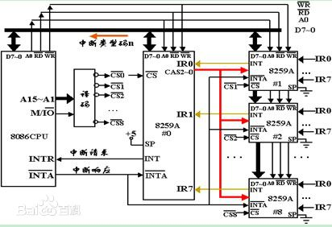

# Interrupt

Ref:https://baike.baidu.com/item/8259A中断控制器

当一个中断请求从IR0到IR7中的某根线到达IMR时，IMR首先判断此IR是否被屏蔽，如果被屏蔽，则此中断请求被丢弃；否则，则将其放入IRR中。

在此中断请求不能进行下一步处理之前，它一直被放在IRR中。一旦发现处理中断的时机已到，Priority Resolver将从所有被放置于IRR中的中断中挑选出一个优先级最高的中断，将其传递给CPU去处理。IR号越低的中断优先级别越高，比如IR0的优先级别是最高的。

8259A通过发送一个INTR(Interrupt Request）信号给CPU，通知CPU有一个中断到达。CPU收到这个信号后，会暂停执行下一条指令，然后发送一个INTA(Interrupt Acknowledge）信号给8259A。8259A收到这个信号之后，马上将ISR中对应此中断请求的Bit设置，同时IRR中相应的bit会被reset。比如，如果当前的中断请求是IR3的话，那么ISR中的bit-3就会被设置，IRR中IR3对应的bit就会被reset。这表示此中断请求正在被CPU处理，而不是正在等待CPU处理。

随后，CPU会再次发送一个INTA信号给8259A，要求它告诉CPU此中断请求的中断向量是什么，这是一个从0到255的一个数。8259A根据被设置的起始向量号（起始向量号通过中断控制字ICW2被初始化）加上中断请求号计算出中断向量号，并将其放置在Data Bus上。比如被初始化的起始向量号为8，当前的中断请求为IR3，则计算出的中断向量为8+3=11。

CPU从Data Bus上得到这个中断向量之后，就去IDT中找到相应的中断服务程序ISR，并调用它。如果8259A的End of Interrupt (EOI）通知被设定位人工模式，那么当ISR处理完该处理的事情之后，应该发送一个EOI给8259A。

8259A得到EOI通知之后，ISR寄存器中对应于此中断请求的Bit会被Reset。

如果8259A的End of Interrupt (EOI）通知被设定位自动模式，那么在第2个INTA信号收到后，8259A ISR寄存器中对应于此中断请求的Bit就会被Reset。

在此期间，如果又有新的中断请求到达，并被放置于IRR中，如果这些新的中断请求中有比在ISR寄存中放置的所有中断优先级别还高的话，那么这些高优先级别的中断请求将会被马上按照上述过程进行处理；否则，这些中断将会被放在IRR中，直到ISR中高优先级别的中断被处理结束，也就是说知道ISR寄存器中高优先级别的bit被Reset为止。
