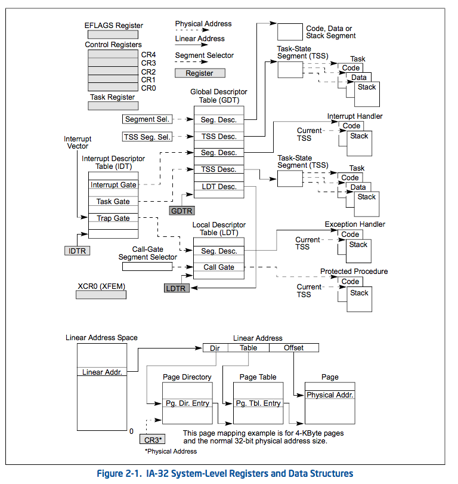

# 基础知识
计算机内，几乎所有的指令都是通过CPU执行的。或者说，所有的操作、逻辑实现都是在CPU的基础上实现的。  
CPU是运转的核心，是生命的心跳。

以下章节，都是IA-32的相关知识

## IA-32 Basic Architecture

## IA-32 Brief History
The following sections provide a summary of the major technical evolutions from IA-32 to Intel 64 architecture: starting from the Intel 8086 processor to the latest Intel® Core® 2 Duo, Core 2 Quad and Intel Xeon processor 5300 and 7300 series. Object code created for processors released as early as 1978 still executes on the latest processors in the Intel 64 and IA-32 architecture families.

### 16-bit Processors and Segmentation (1978)

The IA-32 architecture family was preceded by 16-bit processors, the 8086 and 8088. The 8086 has 16-bit regis- ters and a 16-bit external data bus, with 20-bit addressing giving a 1-MByte address space. The 8088 is similar to the 8086 except it has an 8-bit external data bus.

The 8086/8088 introduced segmentation to the IA-32 architecture. With segmentation, a 16-bit segment register contains a pointer to a memory segment of up to 64 KBytes. Using four segment registers at a time, 8086/8088 processors are able to address up to 256 KBytes without switching between segments. The 20-bit addresses that can be formed using a segment register and an additional 16-bit pointer provide a total address range of 1 MByte.

### The Intel® 286 Processor (1982)

The Intel 286 processor introduced protected mode operation into the IA-32 architecture. Protected mode uses the segment register content as selectors or pointers into descriptor tables. Descriptors provide 24-bit base addresses with a physical memory size of up to 16 MBytes, support for virtual memory management on a segment swapping basis, and a number of protection mechanisms. These mechanisms include:
- Segment limit checking
- Read-only and execute-only segment options
- Four privilege levels

### The Intel386TM Processor (1985)

The Intel386 processor was the first 32-bit processor in the IA-32 architecture family. It introduced 32-bit registers for use both to hold operands and for addressing. The lower half of each 32-bit Intel386 register retains the prop- erties of the 16-bit registers of earlier generations, permitting backward compatibility. The processor also provides a virtual-8086 mode that allows for even greater efficiency when executing programs created for 8086/8088 processors.

In addition, the Intel386 processor has support for:
- A 32-bit address bus that supports up to 4-GBytes of physical memory
- A segmented-memory model and a flat memory model
- Paging, with a fixed 4-KByte page size providing a method for virtual memory management
- Support for parallel stages

### The Intel486TM Processor (1989)

The Intel486TM processor added more parallel execution capability by expanding the Intel386 processor’s instruc- tion decode and execution units into five pipelined stages. Each stage operates in parallel with the others on up to five instructions in different stages of execution.

In addition, the processor added:
- An 8-KByte on-chip first-level cache that increased the percent of instructions that could execute at the scalar rate of one per clock
- An integrated x87 FPU
- Power saving and system management capabilities

### The Intel® Pentium® Processor (1993)

The introduction of the Intel Pentium processor added a second execution pipeline to achieve superscalar perfor- mance (two pipelines, known as u and v, together can execute two instructions per clock). The on-chip first-level cache doubled, with 8 KBytes devoted to code and another 8 KBytes devoted to data. The data cache uses the MESI protocol to support more efficient write-back cache in addition to the write-through cache previously used by the Intel486 processor. Branch prediction with an on-chip branch table was added to increase performance in looping constructs.

In addition, the processor added:
- Extensions to make the virtual-8086 mode more efficient and allow for 4-MByte as well as 4-KByte pages
- Internal data paths of 128 and 256 bits add speed to internal data transfers
- Burstable external data bus was increased to 64 bits
- An APIC to support systems with multiple processors
- A dual processor mode to support glueless two processor systems
  A subsequent stepping of the Pentium family introduced Intel MMX technology (the Pentium Processor with MMX technology). Intel MMX technology uses the single-instruction, multiple-data (SIMD) execution model to perform parallel computations on packed integer data contained in 64-bit registers.

Ref: _Intel 64 and IA-32 Architectures Software Developer's Manual Volume 1-Basic Architecture. Chapter 2.1 BRIEF HISTORY OF INTEL® 64 AND IA-32 ARCHITECTURE_

## 3 BASIC EXECUTION ENVIRONMENT

### 3.1 Operation Mode
The IA-32 architecture supports three basic operating modes: protected mode, real-address mode, and system management mode. The operating mode determines which instructions and architectural features are accessible:

- Protected mode — This mode is the native state of the processor. Among the capabilities of protected mode is the ability to directly execute “real-address mode” 8086 software in a protected, multi-tasking environment. This feature is called virtual-8086 mode, although it is not actually a processor mode. Virtual-8086 mode is actually a protected mode attribute that can be enabled for any task.
- Real-address mode — This mode implements the programming environment of the Intel 8086 processor with extensions (such as the ability to switch to protected or system management mode). The processor is placed in real-address mode following power-up or a reset.
- System management mode (SMM) — This mode provides an operating system or executive with a transparent mechanism for implementing platform-specific functions such as power management and system security. The processor enters SMM when the external SMM interrupt pin (SMI#) is activated or an SMI is received from the advanced programmable interrupt controller (APIC).

  In SMM, the processor switches to a separate address space while saving the basic context of the currently running program or task. SMM-specific code may then be executed transparently. Upon returning from SMM, the processor is placed back into its state prior to the system management interrupt. SMM was introduced with the Intel386TM SL and Intel486TM SL processors and became a standard IA-32 feature with the Pentium processor family.

__注意：操作模式和内存模式不是一个概念，内存模式见下面的"Memory Models"__

### 3.2 OVERVIEW OF THE BASIC EXECUTION ENVIRONMENT

Any program or task running on an IA-32 processor is given a set of resources for executing instructions and for storing code, data, and state information. These resources (described briefly in the following paragraphs and shown in Figure 3-1) make up the basic execution environment for an IA-32 processor.

An Intel 64 processor supports the basic execution environment of an IA-32 processor, and a similar environment under IA-32e mode that can execute 64-bit programs (64-bit sub-mode) and 32-bit programs (compatibility sub- mode).

## 3.3 MEMORY ORGANIZATION

### 3.3.1 IA-32 Memory Models
When employing the processor’s memory management facilities, programs do not directly address physical memory. Instead, they access memory using one of three memory models: flat, segmented, or real address mode:
- Flat memory model — Memory appears to a program as a single, continuous address space (Figure 3-3). This space is called a linear address space. Code, data, and stacks are all contained in this address space. Linear address space is byte addressable, with addresses running contiguously from 0 to 232 - 1 (if not in 64-bit mode). An address for any byte in linear address space is called a linear address.
- Segmented memory model — Memory appears to a program as a group of independent address spaces called segments. Code, data, and stacks are typically contained in separate segments. To address a byte in a segment, a program issues a logical address. This consists of a segment selector and an offset (logical addresses are often referred to as far pointers). The segment selector identifies the segment to be accessed and the offset identifies a byte in the address space of the segment. Programs running on an IA-32 processor can address up to 16,383 segments of different sizes and types, and each segment can be as large as 232 bytes.

  Internally, all the segments that are defined for a system are mapped into the processor’s linear address space. To access a memory location, the processor thus translates each logical address into a linear address. This translation is transparent to the application program.

  The primary reason for using segmented memory is to increase the reliability of programs and systems. For example, placing a program’s stack in a separate segment prevents the stack from growing into the code or data space and overwriting instructions or data, respectively.
- Real-address mode memory model — This is the memory model for the Intel 8086 processor. It is supported to provide compatibility with existing programs written to run on the Intel 8086 processor. The real- address mode uses a specific implementation of segmented memory in which the linear address space for the program and the operating system/executive consists of an array of segments of up to 64 KBytes in size each. The maximum size of the linear address space in real-address mode is 220 bytes.

### 3.4 BASIC PROGRAM EXECUTION REGISTERS
IA-32 architecture provides 16 basic program execution registers for use in general system and application programing (see Figure 3-4). These registers can be grouped as follows:

- General-purpose registers. These eight registers are available for storing operands and pointers.
- Segment registers. These registers hold up to six segment selectors.
- EFLAGS (program status and control) register. The EFLAGS register report on the status of the program being executed and allows limited (application-program level) control of the processor.
- EIP (instruction pointer) register. The EIP register contains a 32-bit pointer to the next instruction to be executed.

#### 3.4.1 General-Purpose Registers
The 32-bit general-purpose registers EAX, EBX, ECX, EDX, ESI, EDI, EBP, and ESP are provided for holding the following items:

- Operands for logical and arithmetic operations
- Operands for address calculations
- Memory pointers

Although all of these registers are available for general storage of operands, results, and pointers, caution should be used when referencing the ESP register. The ESP register holds the stack pointer and as a general rule should not be used for another purpose.

Many instructions assign specific registers to hold operands. For example, string instructions use the contents of the ECX, ESI, and EDI registers as operands. When using a segmented memory model, some instructions assume that pointers in certain registers are relative to specific segments. For instance, some instructions assume that a pointer in the EBX register points to a memory location in the DS segment.

#### 3.4.2 Segment Registers
The segment registers (CS, DS, SS, ES, FS, and GS) hold 16-bit segment selectors. A segment selector is a special pointer that identifies a segment in memory. To access a particular segment in memory, the segment selector for that segment must be present in the appropriate segment register.

When writing application code, programmers generally create segment selectors with assembler directives and symbols. The assembler and other tools then create the actual segment selector values associated with these directives and symbols. If writing system code, programmers may need to create segment selectors directly. See Chapter 3, “Protected-Mode Memory Management,” in the Intel® 64 and IA-32 Architectures Software Developer’s Manual, Volume 3A.

####  3.4.3 EFLAGS Register
The 32-bit EFLAGS register contains a group of status flags, a control flag, and a group of system flags. Figure 3-8 defines the flags within this register. Following initialization of the processor (either by asserting the RESET pin or the INIT pin), the state of the EFLAGS register is 00000002H. Bits 1, 3, 5, 15, and 22 through 31 of this register are reserved. Software should not use or depend on the states of any of these bits.

Some of the flags in the EFLAGS register can be modified directly, using special-purpose instructions (described in the following sections). There are no instructions that allow the whole register to be examined or modified directly.

### 3.6 OPERAND-SIZE AND ADDRESS-SIZE ATTRIBUTES
When the processor is executing in protected mode, every code segment has a default operand-size attribute and address-size attribute. These attributes are selected with the D (default size) flag in the segment descriptor for the code segment (see Chapter 3, “Protected-Mode Memory Management,” in the Intel® 64 and IA-32 Architectures Software Developer’s Manual, Volume 3A). When the D flag is set, the 32-bit operand-size and address-size attri- butes are selected; when the flag is clear, the 16-bit size attributes are selected. When the processor is executing in real-address mode, virtual-8086 mode, or SMM, the default operand-size and address-size attributes are always 16 bits.

### 3.7 OPERAND ADDRESSING
IA-32 machine-instructions act on zero or more operands. Some operands are specified explicitly and others are implicit. The data for a source operand can be located in:
- the instruction itself (an immediate operand)
- a register
- a memory location
- an I/O port

When an instruction returns data to a destination operand, it can be returned to:
- a register
- a memory location
- an I/O port

#### 3.7.7 I/O Port Addressing
The processor supports an I/O address space that contains up to 65,536 8-bit I/O ports. Ports that are 16-bit and 32-bit may also be defined in the I/O address space. An I/O port can be addressed with either an immediate operand or a value in the DX register. See Chapter 17, “Input/Output,” for more information about I/O port addressing.

## 4 DATA TYPES

### 4.1 FUNDAMENTAL DATA TYPES
The fundamental data types are bytes, words, doublewords, quadwords, and double quadwords (see Figure 4-1). A byte is eight bits, a word is 2 bytes (16 bits), a doubleword is 4 bytes (32 bits), a quadword is 8 bytes (64 bits), and a double quadword is 16 bytes (128 bits). A subset of the IA-32 architecture instructions operates on these fundamental data types without any additional operand typing.

### 4.2 NUMERIC DATA TYPES
Although bytes, words, and doublewords are fundamental data types, some instructions support additional inter- pretations of these data types to allow operations to be performed on numeric data types (signed and unsigned integers, and floating-point numbers). Single-precision (32-bit) floating-point and double-precision (64-bit) floating-point data types are supported across all generations of SSE extensions and Intel AVX extensions. Half- precision (16-bit) floating-point data type is supported only with F16C extensions (VCVTPH2PS, VCVTPS2PH). See Figure 4-3.

### 4.3 POINTER DATA TYPES
Pointers are addresses of locations in memory.
In non-64-bit modes, the architecture defines two types of pointers: a near pointer and a far pointer. A near pointer is a 32-bit (or 16-bit) offset (also called an effective address) within a segment. Near pointers are used for all memory references in a flat memory model or for references in a segmented model where the identity of the segment being accessed is implied.

A far pointer is a logical address, consisting of a 16-bit segment selector and a 32-bit (or 16-bit) offset. Far pointers are used for memory references in a segmented memory model where the identity of a segment being accessed must be specified explicitly. Near and far pointers with 32-bit offsets are shown in Figure 4-4.

### 4.4 BIT FIELD DATA TYPE
A bit field (see Figure 4-6) is a contiguous sequence of bits. It can begin at any bit position of any byte in memory and can contain up to 32 bits.

### 4.5 STRING DATA TYPES
Strings are continuous sequences of bits, bytes, words, or doublewords. A bit string can begin at any bit position of any byte and can contain up to 232 – 1 bits. A byte string can contain bytes, words, or doublewords and can range from zero to 232 – 1 bytes (4 GBytes).

## 5 INSTRUCTION SET SUMMARY
This chapter provides an abridged overview of Intel 64 and IA-32 instructions. Instructions are divided into the following groups:
- General purpose
- x87 FPU
- x87 FPU and SIMD state management
- Intel® MMX technology
- SSE extensions
- SSE2 extensions
- SSE3 extensions
- SSSE3 extensions
- SSE4 extensions
- AESNI and PCLMULQDQ
- Intel® AVX extensions
- F16C, RDRAND, RDSEED, FS/GS base access
- FMA extensions
- Intel® AVX2 extensions
- Intel® Transactional Synchronization extensions
- System instructions
- IA-32e mode: 64-bit mode instructions
- VMX instructions
- SMX instructions
- ADCX and ADOX
- Intel® Memory Protection Extensions
- Intel® Security Guard Extensions

### 5.1 GENERAL-PURPOSE INSTRUCTIONS
The general-purpose instructions preform basic data movement, arithmetic, logic, program flow, and string opera- tions that programmers commonly use to write application and system software to run on Intel 64 and IA-32 processors. They operate on data contained in memory, in the general-purpose registers (EAX, EBX, ECX, EDX, EDI, ESI, EBP, and ESP) and in the EFLAGS register. They also operate on address information contained in memory, the general-purpose registers, and the segment registers (CS, DS, SS, ES, FS, and GS).

This group of instructions includes the data transfer, binary integer arithmetic, decimal arithmetic, logic operations, shift and rotate, bit and byte operations, program control, string, flag control, segment register operations, and miscellaneous subgroups. The sections that following introduce each subgroup.